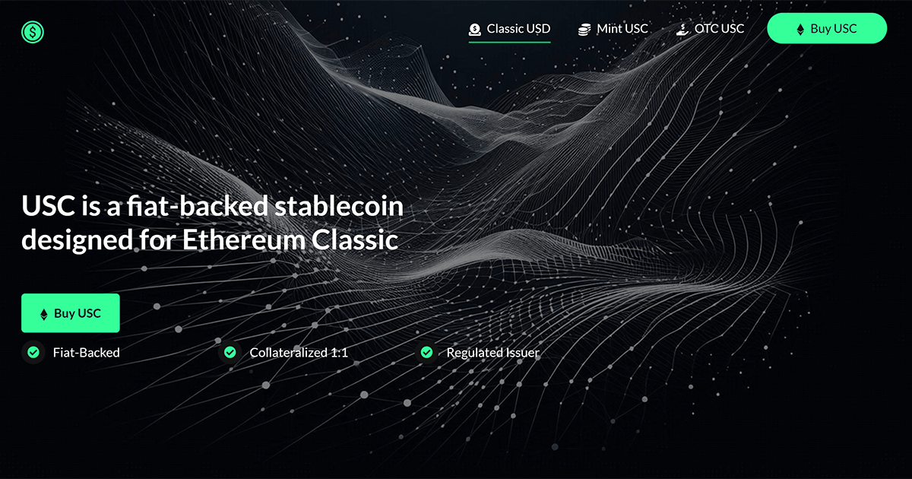

# Classic USD
Classic USD is a multichain fiat-backed stablecoin that connects the Ethereum Classic ecosystem to the global financial world. With quick processing times, low fees, and 1:1 collateralization, Classic USD is simply the best stablecoin product on the Ethereum Classic network. Start using the USC stablecoin today!

## Classic USD Properties

* name: Classic USD
* ticker: USC
* decimals: 6
* type: ERC-20
* short description: Classic USD is the premier native stablecoin for Ethereum Classic’s decentralized finance ecosystem, global payments, and on-chain fiat settlement.

## Classic USD Links
* Classic USD Website: https://classicusd.com
* Brand Assets: https://github.com/classicusd/brand
* Brale Platform Mint/Redeem: https://brale.xyz/stablecoins/USC
* DEX Markets: https://etcswap.org
* AMM Launchpad: https://usc.earnest.fun
* Screener: https://www.coingecko.com/coins/classic-usd

## Classic USD Token Addresses
### Ethereum Classic Ecosystem
* ethereum classic : [0xDE093684c796204224BC081f937aa059D903c52a](https://etc.blockscout.com/token/0xDE093684c796204224BC081f937aa059D903c52a)
* mordor testnet : [0xDE093684c796204224BC081f937aa059D903c52a](https://etc-mordor.blockscout.com/token/0xDE093684c796204224BC081f937aa059D903c52a)
### Other Chains
* polygon : [0x131409B31bF446737dD04353D43DACada544b6fA](https://polygonscan.com/token/0x131409b31bf446737dd04353d43dacada544b6fa)
